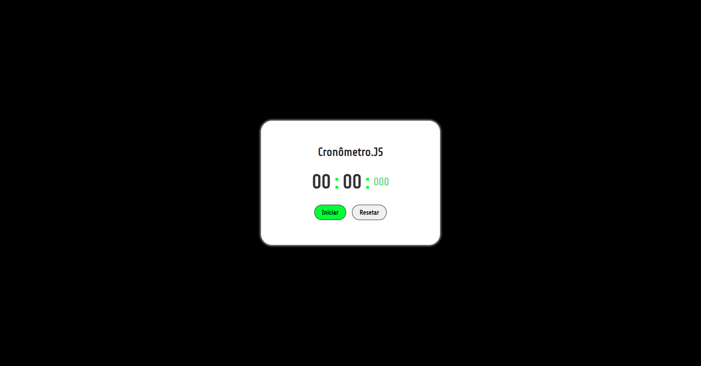

# Cronômetro em JS

 

## Descrição

- Cronômetro com sua base em Java Script.

---
## Tecnologias utilizadas

- HTML

- CSS

- Java Script

## 

- <a href="https://rodrigofrancosantos.github.io/CronometroJS/" >Teste o projeto, aqui !</a>
